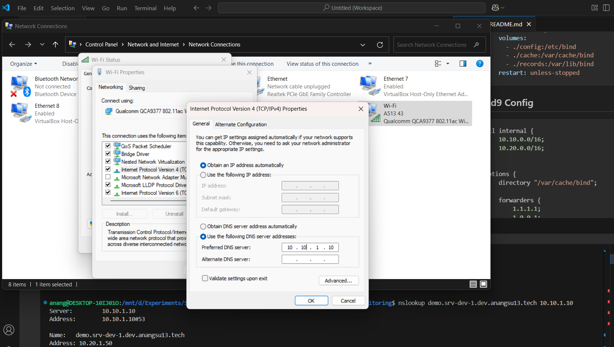
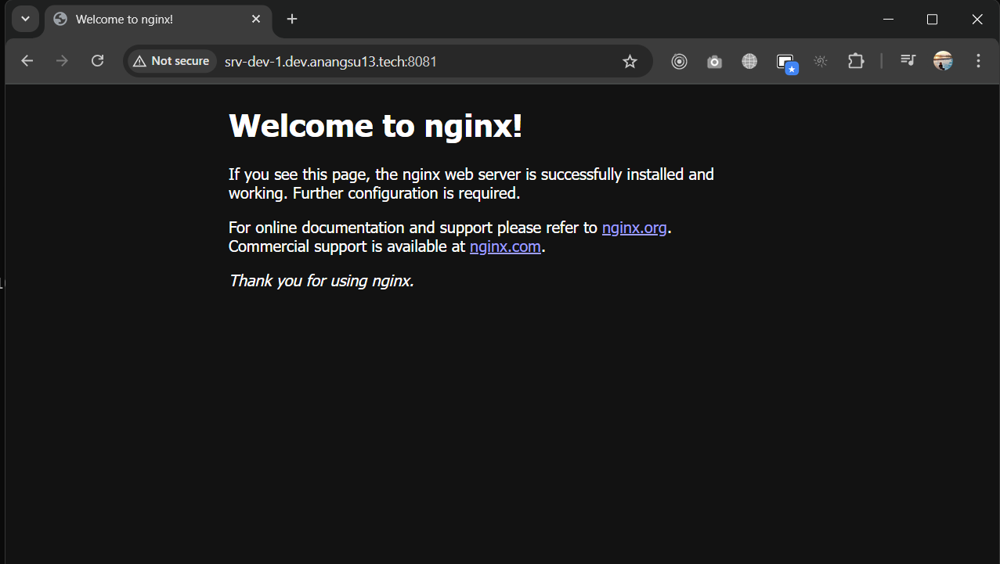

# DNS Server with Bind9

## Infrastructure
- Linux Ubuntu 22.04 (IP address 10.10.1.10)
- Docker

## Install Docker
```bash
# https://docs.docker.com/engine/install/ubuntu/
# Add Docker's official GPG key:
$ sudo apt-get update
$ sudo apt-get install ca-certificates curl
$ sudo install -m 0755 -d /etc/apt/keyrings
$ sudo curl -fsSL https://download.docker.com/linux/ubuntu/gpg -o /etc/apt/keyrings/docker.asc
$ sudo chmod a+r /etc/apt/keyrings/docker.asc

# Add the repository to Apt sources:
$ echo \
  "deb [arch=$(dpkg --print-architecture) signed-by=/etc/apt/keyrings/docker.asc] https://download.docker.com/linux/ubuntu \
  $(. /etc/os-release && echo "${UBUNTU_CODENAME:-$VERSION_CODENAME}") stable" | \
  sudo tee /etc/apt/sources.list.d/docker.list > /dev/null
$ sudo apt-get update

# Install docker latest version
$ sudo apt-get install docker-ce docker-ce-cli containerd.io docker-buildx-plugin docker-compose-plugin
```
## Docker Compose
docker-compose.yaml
```yaml
---
services:
  bind9:
    container_name: dns1-dev
    image: ubuntu/bind9:latest
    environment:
      - BIND_USER=root
      - TZ=Asia/Jakarta
    ports:
      - "53:53/tcp"
      - "53:53/udp"
    volumes:
      - ./config:/etc/bind
      - ./cache:/var/cache/bind
      - ./records:/var/lib/bind
    restart: unless-stopped
```

## Bind9 Config
```ruby
acl internal {
    10.10.0.0/16;
    10.20.0.0/16;
};

options {
	directory "/var/cache/bind";

    forwarders {
        1.1.1.1;
        1.0.0.1;
    };
    allow-query { internal; };
    dnssec-validation no;
};

zone "dev.anangsu13.tech"  IN {
    type master;
    file "/etc/bind/dev-anangsu13-tech.zone";
};
```

## Run with docker compose
```bash
# run bind9
$ sudo docker compose up -d --build

# restart container, jika ada perubahan konfigurasi bind9
$ sudo docker restart <nama_container>

# command tools
$ sudo apt-get install dnsutils
$ sudo apt install net-tools

```
nslookup youtube.com
```bash
$ nslookup youtube.com 10.10.1.10

Server:         10.10.1.10
Address:        10.10.1.10#53

Non-authoritative answer:
Name:   youtube.com
Address: 172.217.194.136
Name:   youtube.com
Address: 172.217.194.93
Name:   youtube.com
Address: 172.217.194.91
Name:   youtube.com
Address: 172.217.194.190
Name:   youtube.com
Address: 2404:6800:4003:c00::5d
Name:   youtube.com
Address: 2404:6800:4003:c00::88
Name:   youtube.com
Address: 2404:6800:4003:c00::be
Name:   youtube.com
Address: 2404:6800:4003:c00::5
```

dig
```bash
$ dig @10.10.1.10 youtube.com

; <<>> DiG 9.18.30-0ubuntu0.22.04.2-Ubuntu <<>> @10.10.1.10 youtube.com
; (1 server found)
;; global options: +cmd
;; Got answer:
;; ->>HEADER<<- opcode: QUERY, status: NOERROR, id: 32711
;; flags: qr rd ra; QUERY: 1, ANSWER: 4, AUTHORITY: 0, ADDITIONAL: 1

;; OPT PSEUDOSECTION:
; EDNS: version: 0, flags:; udp: 1232
; COOKIE: 381aa40285b7691c01000000680c4c7fd4a96e0c29317a11 (good)
;; QUESTION SECTION:
;youtube.com.                   IN      A

;; ANSWER SECTION:
youtube.com.            19      IN      A       74.125.68.136
youtube.com.            19      IN      A       74.125.68.93
youtube.com.            19      IN      A       74.125.68.91
youtube.com.            19      IN      A       74.125.68.190

;; Query time: 119 msec
;; SERVER: 10.10.1.10#53(10.10.1.10) (UDP)
;; WHEN: Sat Apr 26 03:01:19 UTC 2025
;; MSG SIZE  rcvd: 132
```

nslookup srv-dev-1.dev.anangsu13.tech
```bash
$ nslookup srv-dev-1.dev.anangsu13.tech 10.10.1.10

Server:         10.10.1.10
Address:        10.10.1.10#53

Name:   srv-dev-1.dev.anangsu13.tech
Address: 10.20.1.50
```

## Setting DNS Client



## Flush DNS Cache
```powershell
$ nslookup youtube.com

Server:  UnKnown
Address:  10.10.1.10

Non-authoritative answer:
Name:    youtube.com
Addresses:  2404:6800:4003:c04::88
...
```

## Access app - nginx 
IP address app: 10.20.1.50:8081



## Troubleshoting
```
Error response from daemon: failed to set up container networking: driver failed programming external connectivity on endpoint dns1-dev (fb9824f2b05cc23123b95d424073d51d1d7ea0b0f429effed222c9bd89fc5d2a): failed to bind host port for 0.0.0.0:53:172.18.0.2:53/tcp: address already in use
```

Fix issue:
```bash
$ sudo vi /etc/systemd/resolved.conf

# Remove (#) DNSStubListener and change to yes
#Cache=no-negative
#CacheFromLocalhost=no
#DNSStubListener=yes
DNSStubListener=no
#DNSStubListenerExtra=
#ReadEtcHosts=yes

# Restart
$ sudo systemctl restart systemd-resolved
```


<br>

https://www.isc.org/bind/
<br>
https://www.youtube.com/watch?v=syzwLwE3Xq4
<br>
https://medium.com/@jonezy7173_88832/setting-up-bind-dns-for-your-homelab-using-docker-d9fd3ae8e547