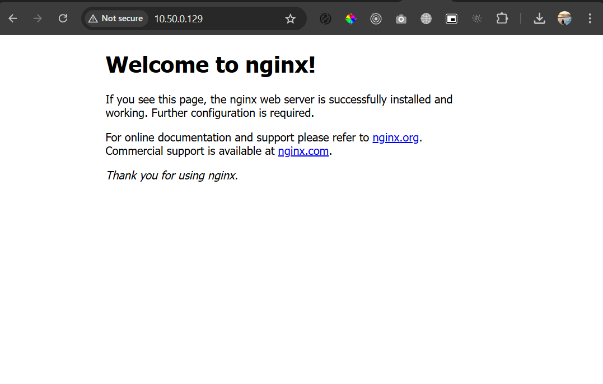

# Docker Network IPvlan Driver

This guide demonstrates how to create a Docker container running Nginx with a static IP (10.50.0.129) on an ipvlan network in Layer 2 mode. The container is connected to the ipvlan-network, which allows it to communicate directly on the physical network via the host interface (eth0)

## Install Docker
```bash
$ sudo apt update

## install docker
$ sudo apt install docker.io -y

## check instalation
$ sudo docker --version
Docker version 24.0.7, build 24.0.7-0ubuntu2~20.04.1
```

## The Parent Interface
```
$ ip a

2: eth0: <BROADCAST,MULTICAST,UP,LOWER_UP> mtu 1500 qdisc fq_codel state UP group default qlen 5000
    inet 10.50.0.200/23 brd 10.50.1.255 scope global eth0  
```

## Create the IPvlan network
```bash
$ sudo docker network create create -d ipvlan \
  --subnet 10.50.0.0/23 \
  --gateway 10.50.0.1 \
  --ip-range 10.50.0.128/25 \
  --aux-address "host=10.50.0.200" \
  -o ipvlan_mode=l2 \
  -o parent=eth0 ipvlan-network
```

docker network create -d ipvlan \
    --subnet=192.168.1.0/24 \
    --gateway=192.168.1.1 \
    -o ipvlan_mode=l2 \
    -o parent=eth0 db_net

## Run a container attaching to ipvlan-network
```
$ sudo docker run --net=ipvlan-network -it --rm alpine /bin/sh
/ # ip a

4: eth0@if2: <BROADCAST,MULTICAST,UP,LOWER_UP,M-DOWN> mtu 1500 qdisc noqueue state UNKNOWN
    inet 10.50.0.128/23 brd 10.50.1.255 scope global eth0
       valid_lft forever preferred_lft forever
```
The container will receive an IP according to the IP range `ip-range` that has been allocated

## Run Container Nginx with Static IP
```bash
$ sudo docker run -d \
  --name nginx-container \
  --net ipvlan-network \
  --ip 10.50.0.129 \
  -p 80:80 \
  nginx
```

## Access nginx from host
```bash
$ ping 10.50.0.129

Pinging 10.50.0.129 with 32 bytes of data:
Reply from 10.50.0.129: bytes=32 time=1ms TTL=64
Reply from 10.50.0.129: bytes=32 time=1ms TTL=64
```




https://docs.docker.com/engine/network/drivers/ipvlan/
