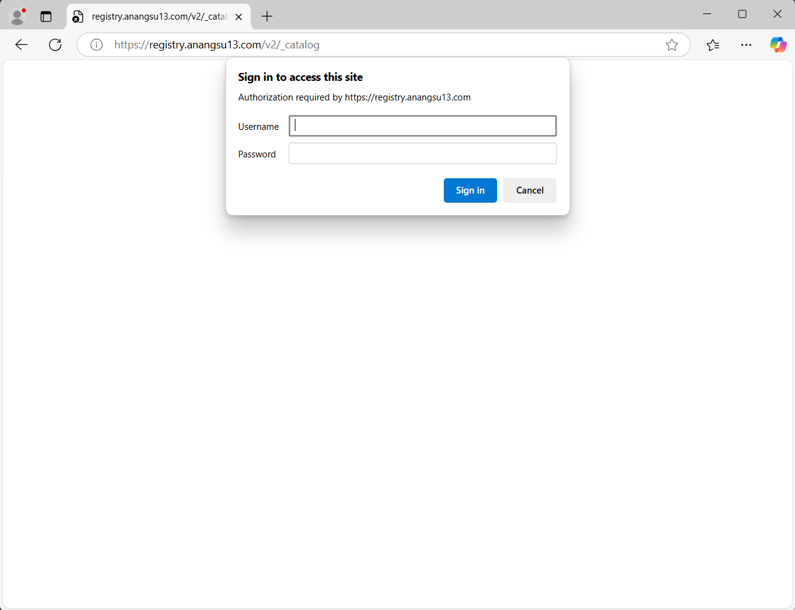
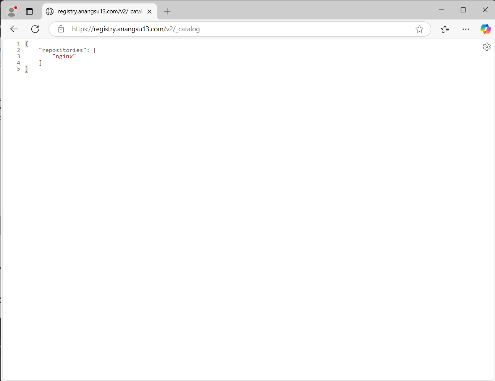

# Self Hosted Docker Registry with Self Signed SSL Certificate


A Self-Hosted Docker Registry with a Self-Signed SSL Certificate running in a Docker container provides a private repository for storing and managing Docker images securely. It uses SSL encryption, even with a self-signed certificate, to protect data transmission within a controlled environment

## Project Directory Structure
```
Dockerfile  certs  nginx.conf  start.sh

/docker-registry
    Dockerfile
    /certs
        cert-key.pem
        cert.pem
        fullchain.pem
    nginx.conf
    start.sh
```

## Create a storage volume for the Docker Registry
```bash
# only support when pxd driver is available
# replication (high availability) = 3
# size = 4GB
#$ sudo docker volume create -d pxd \
#    --name registry_volume \
#    --opt size=4 \
#    --opt block_size=64 \
#    --opt repl=3 \
#    --opt fs=ext4

# driver local
$ sudo docker volume create \
  --driver local \
  --name registry_volume \
  --opt type=none \
  --opt device=/path/to/volume \
  --opt o=bind
```

## Self Signed SSL Certificate
How about generating a Self-Signed SSL Certificate? Please check at [Create a Valid Self-Signed SSL Certificate](https://github.com/anang5u/scalable-microservices-deployment-and-monitoring/tree/main/ssl-self-signed-certificate)

## Docker Registry (Dockerfile)
```dockerfile
FROM registry:2

# Install Apache2-utils untuk htpasswd
RUN apk update && apk add --no-cache nginx apache2-utils

# Membuat file htpasswd dengan username 'user123' dan password 'pass123'
RUN htpasswd -b -c /etc/htpasswd user123 pass123

# Menyalin sertifikat SSL ke dalam container
COPY ./certs /etc/nginx/certs

# Menyalin file konfigurasi Nginx yang telah disesuaikan
COPY ./nginx.conf /etc/nginx/nginx.conf

# Menyalin skrip start.sh untuk menjalankan registry dan nginx
COPY ./start.sh /start.sh
RUN chmod +x /start.sh

# Membuka port 443 untuk Nginx (HTTPS)
EXPOSE 443

# Menyediakan volume untuk data registry
VOLUME ["/var/lib/registry"]

# Menjalankan skrip start.sh yang akan menjalankan Nginx dan Registry
CMD ["/start.sh"]
```

## Nginx Configuration (nginx.conf)
```
worker_processes auto;

events {
    worker_connections 1024;
}

http {
    upstream registry {
        server localhost:5000;
    }

    server {
        server_name registry.anangsu3.com;
        listen 443 ssl;

        # Sertifikat SSL
        ssl_certificate /etc/nginx/certs/fullchain.pem;
        ssl_certificate_key /etc/nginx/certs/cert-key.pem;
        ssl_trusted_certificate /etc/nginx/certs/fullchain.pem;

        ssl_protocols TLSv1.1 TLSv1.2;
        ssl_ciphers 'EECDH+AESGCM:EDH+AESGCM:AES256+EECDH:AES256+EDH';
        ssl_prefer_server_ciphers on;
        ssl_session_cache shared:SSL:10m;

        # disable any limits to avoid HTTP 413 for large image uploads
        client_max_body_size 0;

        # required to avoid HTTP 411: see Issue #1486 (https://github.com/moby/moby/issues/1486)
        chunked_transfer_encoding on;


        # To add basic authentication to v2 use auth_basic setting.
        auth_basic "Registry realm";
        auth_basic_user_file /etc/htpasswd;

        location /v2/ {
            # important setting for large images
            client_max_body_size                1000m;

            proxy_pass                          http://localhost:5000;
            proxy_set_header  Host              $http_host;
            proxy_set_header  X-Real-IP         $remote_addr;
            proxy_set_header  X-Forwarded-For   $proxy_add_x_forwarded_for;
            proxy_set_header  X-Forwarded-Proto $scheme;
            proxy_read_timeout                  900;
        }
    }
}
```

## start.sh
```bash
#!/bin/sh

# Menjalankan Docker Registry di background
/bin/registry serve /etc/docker/registry/config.yml &

# Menjalankan Nginx di foreground
nginx -g "daemon off;"
```

## Build Docker Image
```bash
$ sudo docker build -t my-secure-registry .
```


## Run Docker Registry as Docker Container with Static IP Address
How about setting up a Docker network with the IPvlan driver? 
[Please follow these steps](https://github.com/anang5u/scalable-microservices-deployment-and-monitoring/tree/main/docker-network)

```bash
$ sudo docker run -d -p 443:443 --name secure-registry \
  --net ipvlan-network \
  --ip 10.50.0.12 \
  -v registry_volume:/var/lib/registry \
  my-secure-registry

# view docker container
$ sudo docker container ps
CONTAINER ID   IMAGE                COMMAND                  CREATED         STATUS         PORTS     NAMES
57f5d60ca03e   my-secure-registry   "/entrypoint.sh /sta…"   7 seconds ago   Up 6 seconds             secure-registry

# view docker log
$ sudo docker logs <container-name>

# enter the docker container
$ sudo docker container exec -it <container-name> /bin/sh

# verify user password
$ htpasswd -v /etc/htpasswd user123
Enter password:
Password for user user123 correct.

# view nginx logs
$ tail -f /var/log/nginx/error.log
```

### Make virtual hosts on windows
```
located at:
c:\Windows\System32\Drivers\etc\hosts

10.50.0.12 registry.anangsu13.com
```

## Login into Docker Registry
```bash
# Login
$ docker login registry.anangsu13.com
Username: user123
Password:

Login Succeeded

# Logout
$ docker logout registry.anangsu13.com
Removing login credentials for registry.anangsu13.com
```

## Push and Pull Image
```bash
# Pull image from docker hub
$ docker pull nginx

# Tag the image so that it points to private registry
$ docker image tag nginx registry.anangsu13.com/nginx

# Push it
$ docker push registry.anangsu13.com/nginx

Using default tag: latest
The push refers to repository [registry.anangsu13.com/nginx]
b57b5eac2941: Pushed
58045dd06e5b: Pushed
541cf9cf006d: Pushed
32c977818204: Pushed
943132143199: Pushed
88ebb510d2fb: Pushed
f5fe472da253: Pushed
latest: digest: sha256:e49b2893e997eeda7716bd7f3b2ed60aac69faa4041a4a3b88fb885609703cbb size: 1778

# Pull it back
$ docker pull registry.anangsu13.cloud/nginx

# View all image
$ docker image ls

REPOSITORY                            TAG       IMAGE ID       CREATED       SIZE
registry.anangsu13.com/nginx          latest    9bea9f2796e2   7 weeks ago   192MB
nginx                                 latest    9bea9f2796e2   7 weeks ago   192MB

```



Related link:<br>
https://github.com/anang5u/kubernetes/tree/master/docker/authenticate-proxy-with-nginx