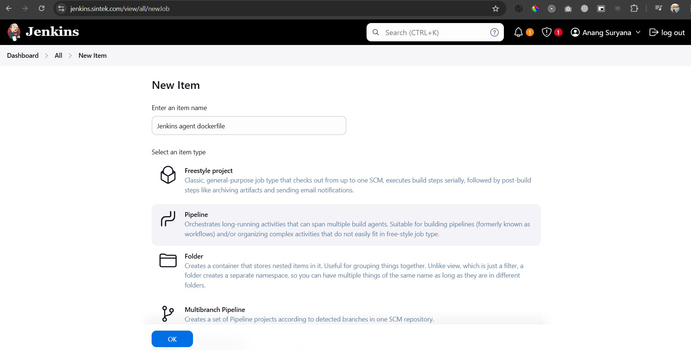
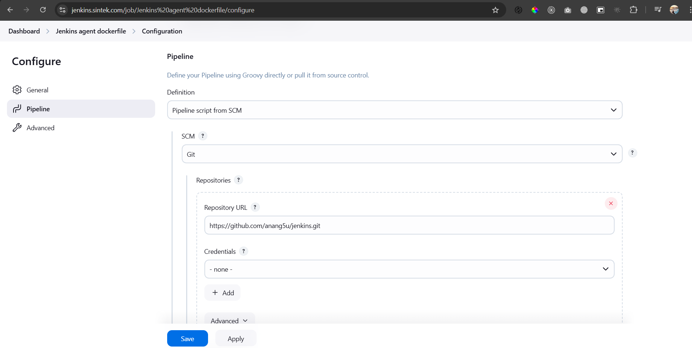

# Jenkins with Dockerfile As Build Agents

Using Jenkins agents with Dockerfiles offers isolation, portability, and consistency, making it easier to manage dependencies and scale. However, it introduces potential performance overhead, complexity in management, security concerns (especially with Docker-in-Docker), and resource limitations

## Install Jenkins
For instructions on how to install Jenkins in a Docker container and make it compatible with Jenkins agents using a Dockerfile, you can follow [`Install Jenkins in Docker Container with SSL`](https://github.com/anang5u/scalable-microservices-deployment-and-monitoring/tree/main/jenkins-ssl-docker-container)

## Add Jenkins Plugin
Located at `Dashboard -> Manage Jenkins -> Plugins -> Available Plugins`, Add jenkins plugin `Docker Pipeline`

## Dockerfile and Jenkisfile
Both Dockerfile and Jenkinsfile located at git repository 
https://github.com/anang5u/jenkins.git

Dockerfile:
```dockerfile
FROM node:20.18-alpine3.21

RUN apk add --no-cache git curl
```

Jenkinsfile:
```groovy
pipeline {
  agent { dockerfile true }
  stages {
    stage('Test') {
      steps {
        sh '''
          node --version
          git --version
          curl --version
        '''
      }
    }
  }
}
```

## Create Pipeline

### Create New Item
Located at `Dashboard -> New Item`
<ol>
<li>Enter an item name : Jenkins agent dockerfile</li>
<li>Select an item type: Pipeline</li>
<li>Click OK</li>
</ol>



### Configuration
In the general description, please type `Jenkins agent Dockerfile`, and scroll down to the `Pipeline` configuration.

<ol>
<li>Definition : Pipeline script from SCM</li>
<li>SCM: Git</li>
<li>Repositories - Repository URL : https://github.com/anang5u/jenkins.git</li>
<li>Branches to build - Branch Specifier (blank for 'any') : */main</li>
<li>Click Save</li>
</ol>



### Build Now
Console Output:

```bash
Started by user Anang Suryana
Obtained Jenkinsfile from git https://github.com/anang5u/jenkins.git
[Pipeline] Start of Pipeline
[Pipeline] node
Running on Jenkins in /var/jenkins_home/workspace/Jenkins agent dockerfile
[Pipeline] {
[Pipeline] stage
[Pipeline] { (Declarative: Checkout SCM)
[Pipeline] checkout
Selected Git installation does not exist. Using Default
The recommended git tool is: NONE
No credentials specified
 > git rev-parse --resolve-git-dir /var/jenkins_home/workspace/Jenkins agent dockerfile/.git # timeout=10
Fetching changes from the remote Git repository
 > git config remote.origin.url https://github.com/anang5u/jenkins.git # timeout=10
Fetching upstream changes from https://github.com/anang5u/jenkins.git
 > git --version # timeout=10
 > git --version # 'git version 2.39.5'
 > git fetch --tags --force --progress -- https://github.com/anang5u/jenkins.git +refs/heads/*:refs/remotes/origin/* # timeout=10
 > git rev-parse refs/remotes/origin/main^{commit} # timeout=10
Checking out Revision 1e345414bdd7f70f34e285e5844bc50893920232 (refs/remotes/origin/main)
 > git config core.sparsecheckout # timeout=10
 > git checkout -f 1e345414bdd7f70f34e285e5844bc50893920232 # timeout=10
Commit message: "jenkins agent dockerfile"
 > git rev-list --no-walk 1e345414bdd7f70f34e285e5844bc50893920232 # timeout=10
[Pipeline] }
[Pipeline] // stage
[Pipeline] withEnv
[Pipeline] {
[Pipeline] stage
[Pipeline] { (Declarative: Agent Setup)
[Pipeline] isUnix
[Pipeline] readFile
[Pipeline] sh
+ docker build -t 31783b352224d1128c523eca8c542c00fb9b27d7 -f Dockerfile .
#0 building with "default" instance using docker driver

#1 [internal] load build definition from Dockerfile
#1 transferring dockerfile: 96B done
#1 DONE 0.0s

#2 [internal] load metadata for docker.io/library/node:20.18-alpine3.21
#2 DONE 2.1s

#3 [internal] load .dockerignore
#3 transferring context: 2B done
#3 DONE 0.0s

#4 [1/2] FROM docker.io/library/node:20.18-alpine3.21@sha256:2cd2a6f4cb37cf8a007d5f1e9aef090ade6b62974c7a274098c390599e8c72b4
#4 DONE 0.0s

#5 [2/2] RUN apk add --no-cache git curl
#5 CACHED

#6 exporting to image
#6 exporting layers done
#6 writing image sha256:af1f19e300e83070621a971d23870bb361de6109c5e77ff3f4342319ec58b072 done
#6 naming to docker.io/library/31783b352224d1128c523eca8c542c00fb9b27d7 done
#6 DONE 0.0s
[Pipeline] }
[Pipeline] // stage
[Pipeline] isUnix
[Pipeline] withEnv
[Pipeline] {
[Pipeline] sh
+ docker inspect -f . 31783b352224d1128c523eca8c542c00fb9b27d7
.
[Pipeline] }
[Pipeline] // withEnv
[Pipeline] withDockerContainer
Jenkins seems to be running inside container ceb9e3ce5e98070079876dcf23c134c59dbfb4695b33334f79e4fe6af708cebf
but /var/jenkins_home/workspace/Jenkins agent dockerfile could not be found among []
but /var/jenkins_home/workspace/Jenkins agent dockerfile@tmp could not be found among []
$ docker run -t -d -u 0:0 -w "/var/jenkins_home/workspace/Jenkins agent dockerfile" -v "/var/jenkins_home/workspace/Jenkins agent dockerfile:/var/jenkins_home/workspace/Jenkins agent dockerfile:rw,z" -v "/var/jenkins_home/workspace/Jenkins agent dockerfile@tmp:/var/jenkins_home/workspace/Jenkins agent dockerfile@tmp:rw,z" -e ******** -e ******** -e ******** -e ******** -e ******** -e ******** -e ******** -e ******** -e ******** -e ******** -e ******** -e ******** -e ******** -e ******** -e ******** -e ******** -e ******** -e ******** -e ******** -e ******** -e ******** -e ******** -e ******** -e ******** -e ******** -e ******** -e ******** -e ******** -e ******** -e ******** 31783b352224d1128c523eca8c542c00fb9b27d7 cat
$ docker top b0f83a25ab90b5fa1bd54e26a25279fa9ff7cef55013cfc5cce8e88e6d8700b7 -eo pid,comm
[Pipeline] {
[Pipeline] stage
[Pipeline] { (Test)
[Pipeline] sh
+ node --version
v20.18.2
+ git --version
git version 2.47.2
+ curl --version
curl 8.11.1 (x86_64-alpine-linux-musl) libcurl/8.11.1 OpenSSL/3.3.2 zlib/1.3.1 brotli/1.1.0 zstd/1.5.6 c-ares/1.34.3 libidn2/2.3.7 libpsl/0.21.5 nghttp2/1.64.0
Release-Date: 2024-12-11
Protocols: dict file ftp ftps gopher gophers http https imap imaps ipfs ipns mqtt pop3 pop3s rtsp smb smbs smtp smtps telnet tftp ws wss
Features: alt-svc AsynchDNS brotli HSTS HTTP2 HTTPS-proxy IDN IPv6 Largefile libz NTLM PSL SSL threadsafe TLS-SRP UnixSockets zstd
[Pipeline] }
[Pipeline] // stage
[Pipeline] }
$ docker stop --time=1 b0f83a25ab90b5fa1bd54e26a25279fa9ff7cef55013cfc5cce8e88e6d8700b7
$ docker rm -f --volumes b0f83a25ab90b5fa1bd54e26a25279fa9ff7cef55013cfc5cce8e88e6d8700b7
[Pipeline] // withDockerContainer
[Pipeline] }
[Pipeline] // withEnv
[Pipeline] }
[Pipeline] // node
[Pipeline] End of Pipeline
Finished: SUCCESS
```
