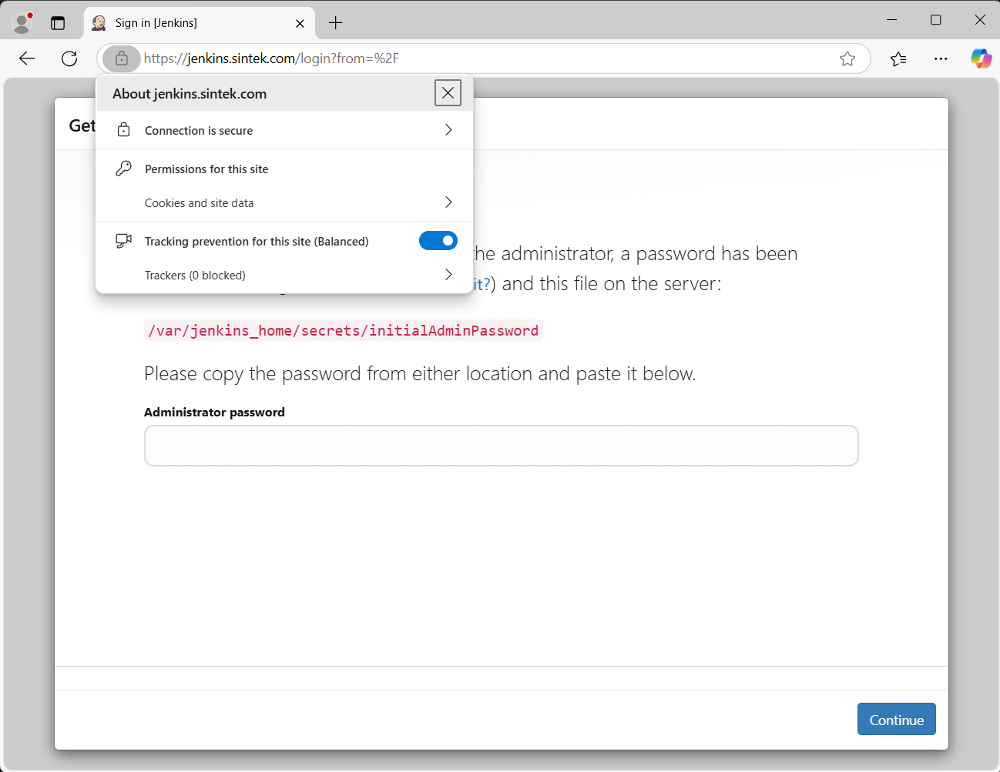

# Install Jenkins in Docker Container with SSL

Install Jenkins in a Docker container with SSL by setting up a self-signed certificate for secure communication. Use nginx as a reverse proxy to forward requests to Jenkins, enabling SSL termination and enhancing security for the web application

## Project Directory Structure
```
/jenkins
    Dockerfile
    /certs
        cert-key.pem
        fullchain.pem
    nginx.conf
    start.sh
```

## Generate SSL
How about generating a Self-Signed SSL Certificate? Please check at [Create a Valid Self-Signed SSL Certificate](https://github.com/anang5u/scalable-microservices-deployment-and-monitoring/tree/main/ssl-self-signed-certificate)

## Jenkins Image with Nginx as Proxy
```dockerfile
FROM jenkins/jenkins:2.479.3-jdk17

# Update dan install nginx menggunakan apt-get
USER root

# Menambahkan 10.50.0.220 ke /etc/hosts
# Self hosted docker registry
RUN echo "10.50.0.220  registry.sintek.com" >> /etc/hosts
#RUN echo "192.168.1.21  my-custom-hostname" >> /etc/#hosts && \
#    echo "192.168.1.22  another-hostname" >> /etc/hosts

# Update sistem dan install Docker dan dependencies lainnya
RUN apt-get update && \
    apt-get install -y \
    nginx \
    apt-transport-https \
    ca-certificates \
    curl \
    gnupg2 \
    lsb-release \
    sudo && \
    mkdir -m 0755 -p /etc/apt/keyrings && \
    curl -fsSL https://download.docker.com/linux/ubuntu/gpg -o /etc/apt/keyrings/docker.asc && \
    echo "deb [arch=$(dpkg --print-architecture) signed-by=/etc/apt/keyrings/docker.asc] https://download.docker.com/linux/ubuntu focal stable" | tee /etc/apt/sources.list.d/docker.list > /dev/null && \
    apt-get update && \
    apt-get install -y docker-ce docker-ce-cli containerd.io docker-buildx-plugin docker-compose-plugin && \
    apt-get clean

# Verifikasi apakah Docker berhasil terinstall
RUN docker --version

# Menyalin sertifikat SSL ke dalam container
COPY ./certs /etc/nginx/certs

# Salin sertifikat CA ke dalam container
COPY ./certs/ca.pem /usr/local/share/ca-certificates/ca.crt

# Perbarui CA certificates
RUN update-ca-certificates

# Menyalin file konfigurasi Nginx yang telah disesuaikan
COPY ./nginx.conf /etc/nginx/nginx.conf

# Menyalin skrip start.sh untuk menjalankan registry dan nginx
COPY ./start.sh /start.sh
RUN chmod +x /start.sh

# Membuka port 443 untuk Nginx (HTTPS) dan 8080 untuk Jenkins (HTTP)
EXPOSE 443 8080

# Menjalankan skrip start.sh yang akan menjalankan Nginx dan Jenkins
CMD ["/start.sh"]
```

## nginx.conf
```
events {
    worker_connections 1024;  # Jumlah koneksi maksimum per worker
}

http {
    server {
        listen 80;
        server_name jenkins.sintek.com;

        # Redirect HTTP ke HTTPS
        return 301 https://$host$request_uri;
    }

    server {
        listen 443 ssl;
        server_name jenkins.sintek.com;

        # Sertifikat SSL
        ssl_certificate /etc/nginx/certs/fullchain.pem;
        ssl_certificate_key /etc/nginx/certs/cert-key.pem;
        ssl_trusted_certificate /etc/nginx/certs/fullchain.pem;

        ssl_protocols TLSv1.1 TLSv1.2;
        ssl_ciphers 'EECDH+AESGCM:EDH+AESGCM:AES256+EECDH:AES256+EDH';
        ssl_prefer_server_ciphers on;
        ssl_session_cache shared:SSL:10m;

        # Konfigurasi untuk mengatur proxy ke Jenkins
        location / {
            proxy_pass http://127.0.0.1:8080;  # Akses ke Jenkins di localhost:8080
            proxy_set_header Host $host;
            proxy_set_header X-Real-IP $remote_addr;
            proxy_set_header X-Forwarded-For $proxy_add_x_forwarded_for;
            proxy_set_header X-Forwarded-Proto $scheme;
        }
    }
}
```

## start.sh
```bash
#!/bin/sh

# Atur ulimit
# prevent ERROR : ulimit: error setting limit (Operation not permitted)
ulimit -l unlimited
ulimit -n 10240
ulimit -c unlimited

# Mulai Docker di background
echo "Starting Docker..."
service docker start &

# Mulai Jenkins di background, pastikan hanya mendengarkan di localhost
echo "Starting Jenkins..."
java -jar /usr/share/jenkins/jenkins.war --httpListenAddress=127.0.0.1 --httpPort=8080 &

# Menunggu Jenkins siap (opsional, menunggu 30 detik)
sleep 30

# Mulai Nginx
echo "Starting Nginx..."
nginx -g 'daemon off;'
```

## Build Image
```bash
$ sudo docker build -t jenkins-proxy .

# Optional
# $ sudo docker build -t jenkins-proxy . --network=host
```

## Run Image as a Docker Container
Run image with static IP Address 10.50.0.210 with docker network ipvlan. [In this section](https://github.com/anang5u/scalable-microservices-deployment-and-monitoring/tree/main/docker-network) is about creating docker network ipvlan
```bash
$ sudo docker run -d \
  --privileged \
  -p 80:80 -p 443:443 \
  --name jenkins-ssl \
  --volume jenkins-data:/var/jenkins_home \
  --net ipvlan-network \
  --ip 10.50.0.210 \
  jenkins-proxy

# Check logs unlock jenkins
$ sudo docker log <container-name>
# check ulimit
$ ulimit
# check service nginx and docker
$ sevice nginx status
$ sevice docker status


# check log nginx
$ tail -f /var/log/nginx/error.log

# ssl certificates info
$ openssl x509 -in /etc/nginx/certs/fullchain.pem -noout -text

# docker container logs
$ sudo docker logs -f --tail 10 <container-id/name>

# docker status
$ sudo service docker status
```

### Create Virtual Hosts in Windows
```
located at:
c:\Windows\System32\Drivers\etc\hosts

10.50.0.210 jenkins.sintek.com
```



Docker image:<br>
https://hub.docker.com/r/jenkins/jenkins/tags

Official Doc:<br>
https://www.jenkins.io/doc/book/installing/
