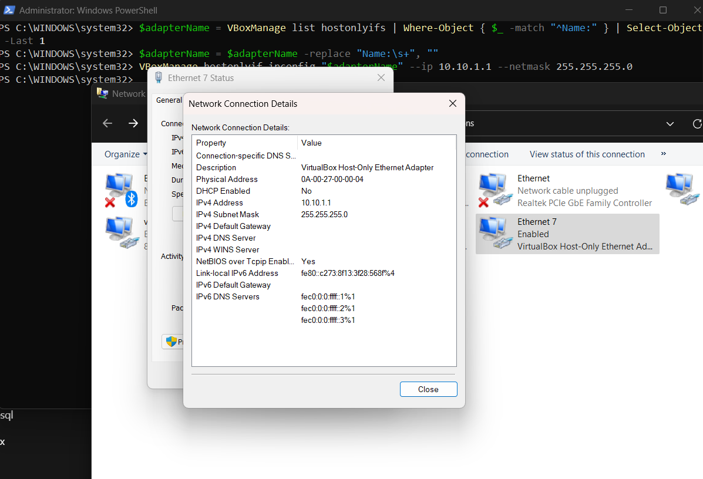

# NAT Network and Host-Only Network VirtualBox

Kita membutuhkan network:
- NAT Network untuk internet
- Host-Only Network untuk komunikasi host-VM

## Create VirtualBox Host-Only Adapter
Pada Windows, jalankan `PowerShell` sebagai Administrator
```powershell
# Tambahkan adapter host-only baru
# Pastikan path C:\Program Files\Oracle\VirtualBox\ sudah masuk ke environment variable
$ VBoxManage hostonlyif create

# Ambil nama adapter dari output VBoxManage yang benar (tanpa "HostInterfaceNetworking-")
# VirtualBox Host-Only Ethernet Adapter #2
$ $adapterName = VBoxManage list hostonlyifs | Where-Object { $_ -match "^Name:" } | Select-Object -Last 1
$ $adapterName = $adapterName -replace "Name:\s+", ""

# Set IP address dan subnet mask
$ VBoxManage hostonlyif ipconfig "$adapterName" --ip 10.10.1.1 --netmask 255.255.255.0

# Verifikasi hasil
$ VBoxManage list hostonlyifs

# Hapus host-only adapter
$ VBoxManage hostonlyif remove "<adapter name>"
```

Setalah berhasil dibuat akan nampak seperti pada gambar berikut:



Kemudian jalankan `Oracle VM VirtualBox`, akan nampak seperti berikut:


## PowerShell Tips
```powershell
# mempersingkat tampilan layar
$ Set-Location 'D:\Exp...\network\vagrant-vb1'

$ function prompt {
    "$([System.IO.Path]::GetFileName($(Get-Location)))> "
 }
```