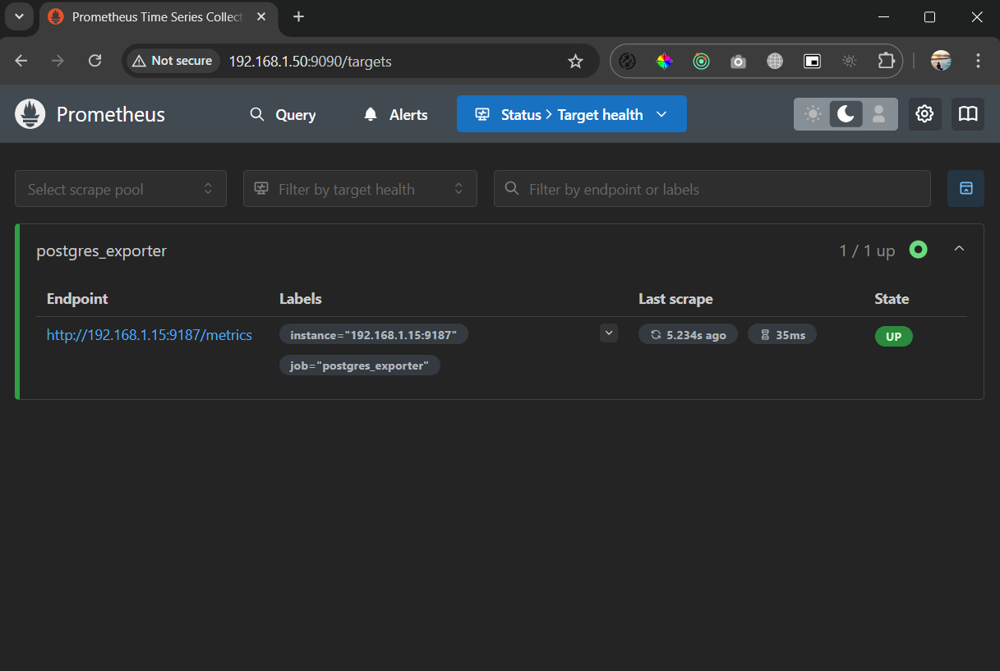
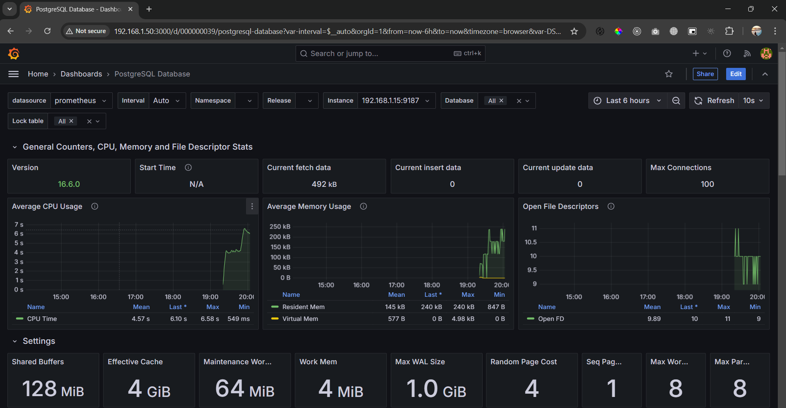

# Monitoring PostgreSQL 16 with Prometheus and Grafana on Ubuntu 20.04 #2

This session will cover the installation of Prometheus and Grafana on Ubuntu 20.04 (Focal Fossa), along with the setup of a Grafana dashboard for monitoring PostgreSQL 16.

## Create a System User for Prometheus
```bash
# create a group and then add a user to the group
$ sudo groupadd --system prometheus
$ sudo useradd -s /sbin/nologin --system -g prometheus prometheus
```

## Create Directories for Prometheus
```bash
# The directories will be located in the /etc and the /var/lib directory respectively.
$ sudo mkdir /etc/prometheus
$ sudo mkdir /var/lib/prometheus
```

## Download Prometheus and Extract Files
```bash
# See for latest version
# https://prometheus.io/download/#prometheus
$ cd /tmp/
$ wget https://github.com/prometheus/prometheus/releases/download/v3.0.1/prometheus-3.0.1.linux-amd64.tar.gz

#  extract the contents of the downloaded file
$ tar vxf prometheus*.tar.gz

# navigate to the newly extracted Prometheus directory
$ cd prometheus*/
$ ls
LICENSE  NOTICE  prometheus  prometheus.yml  promtool
```

## Move the Binary Files & Set Owner
```bash
# move some binary files (prometheus and promtool) and change the ownership of the files to the "prometheus" user and group
$ sudo mv prometheus /usr/local/bin
$ sudo mv promtool /usr/local/bin
$ sudo chown prometheus:prometheus /usr/local/bin/prometheus
$ sudo chown prometheus:prometheus /usr/local/bin/promtool
```

## Move the Configuration Files & Set Owner
```bash
# move the configuration files and set their ownership so that Prometheus can access them
$ sudo mv prometheus.yml /etc/prometheus
$ sudo chown prometheus:prometheus /etc/prometheus
$ sudo chown -R prometheus:prometheus /var/lib/prometheus
```

## Adding postgres_exporter to Prometheus
```bash
$ sudo nano /etc/prometheus/prometheus.yml

# PostgreSQL Monitoring with postgres_exporter
scrape_configs:
  # PostgreSQL Monitoring with postgres_exporter
  - job_name: "postgres_exporter"
    scrape_interval: 5s
    static_configs:
      - targets: ["192.168.1.15:9187"]
```

## Create Prometheus Systemd Service
```bash
$ sudo nano /etc/systemd/system/prometheus.service
```

Include these settings to the file, save, and exit:
```
[Unit]
Description=Prometheus
Wants=network-online.target
After=network-online.target

[Service]
User=prometheus
Group=prometheus
Type=simple
ExecStart=/usr/local/bin/prometheus \
    --config.file /etc/prometheus/prometheus.yml \
    --storage.tsdb.path /var/lib/prometheus/

[Install]
WantedBy=multi-user.target
```

## Reload Systemd
```bash
$ sudo systemctl daemon-reload
```

## Start Prometheus Service
```bash
$ sudo systemctl enable prometheus
$ sudo systemctl start prometheus
$ sudo systemctl status prometheus

# Another command
$ prometheus --version
$ promtool --version
```

```
$ sudo systemctl status prometheus
● prometheus.service - Prometheus
     Loaded: loaded (/etc/systemd/system/prometheus.service; enabled; vendor preset: enabled)
     Active: active (running) since Sat 2024-12-07 12:19:18 UTC; 4s ago
   Main PID: 2225 (prometheus)
      Tasks: 6 (limit: 1130)
     Memory: 15.7M
...
```

Now, We have prometheus up and running successfully, you can access it via your web browser using localhost:9090 or <ip_address>:9090


## Install Grafana
```bash
# Install the prerequisite packages
$ sudo apt-get install -y apt-transport-https software-properties-common wget

# Import the GPG key
$ sudo mkdir -p /etc/apt/keyrings/
$ wget -q -O - https://apt.grafana.com/gpg.key | gpg --dearmor | sudo tee /etc/apt/keyrings/grafana.gpg > /dev/null

# add a repository for stable releases
$ echo "deb [signed-by=/etc/apt/keyrings/grafana.gpg] https://apt.grafana.com stable main" | sudo tee -a /etc/apt/sources.list.d/grafana.list

# Run the following command to update the list of available packages
# Updates the list of available packages
$ sudo apt-get update

# install Grafana OSS
# Installs the latest OSS release:
$ sudo apt-get install grafana

# Enable and start Grafana server
$ sudo systemctl enable grafana-server
$ sudo systemctl start grafana-server
$ sudo systemctl status grafana-server
```

```
$ sudo systemctl status grafana-server
● grafana-server.service - Grafana instance
     Loaded: loaded (/lib/systemd/system/grafana-server.service; enabled; vendor preset: enabled)
     Active: active (running) since Sat 2024-12-07 12:50:18 UTC; 3s ago
       Docs: http://docs.grafana.org
   Main PID: 3485 (grafana)
      Tasks: 5 (limit: 1130)
     Memory: 60.8M
     CGroup: /system.slice/grafana-server.service
```
Access grafana via web browser using localhost:3000 or <ip_address>:3000. Enter <b>admin</b> into both the <b>Email or username</b> and <b>Password</b> fields and then click on the Log in button


## Setting up Dashboard Monitoring via Grafana
Create New and Import Dashboard <b>9628</b> for PostgreSQL Monitoring and select 'Prometheus' as the data source. 

After the Grafana dashboard is imported, check your new dashboard and you should see the PostgreSQL dashboard monitoring as below:


Source:
- https://www.cherryservers.com/blog/install-prometheus-ubuntu
- https://www.howtoforge.com/how-to-monitor-postgresql-with-prometheus-and-grafana/#adding-postgresexporter-to-prometheus
- https://grafana.com/docs/grafana/latest/setup-grafana/installation/debian/
- https://www.digitalocean.com/community/tutorials/how-to-install-and-secure-grafana-on-ubuntu-20-04
