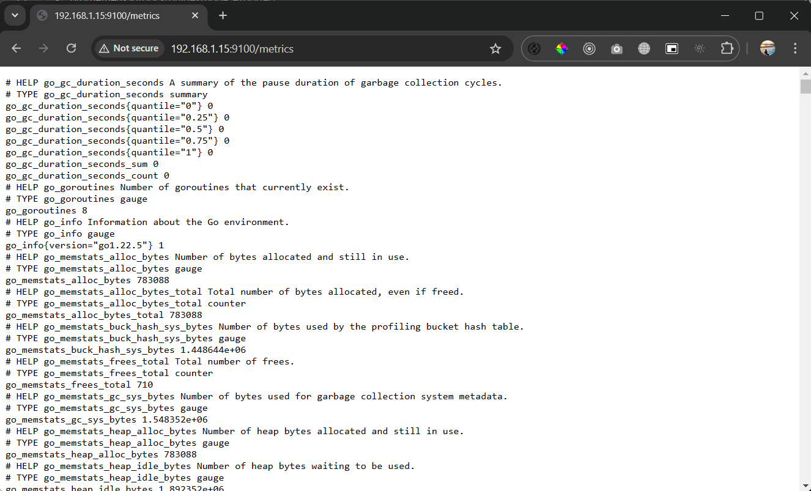
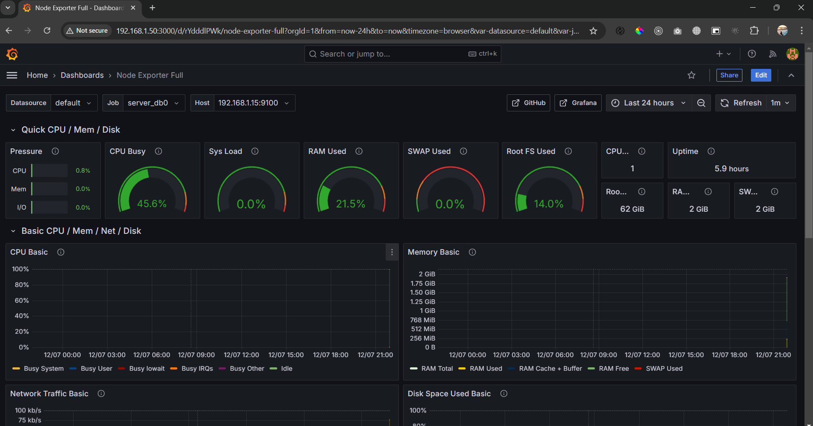

## Monitoring Linux host metrics with the Node Exporter

This guide will explain how to install and configure the [<b>Node Exporter</b>](https://github.com/prometheus/node_exporter) as a systemd service to monitor Linux host metrics. It will also cover the integration of Node Exporter with Prometheus for data collection and Grafana for visualization, enabling effective monitoring of system performance.

## Download Node Exporter
```bash
# See for latest version
# https://github.com/prometheus/node_exporter
$ cd /tmp/
$ wget https://github.com/prometheus/node_exporter/releases/download/v1.8.2/node_exporter-1.8.2.linux-amd64.tar.gz

#  extract the contents of the downloaded file
$ tar vxf node_exporter*.tar.gz

# Remove downloaded file after extracted
$ sudo rm -rf node_exporter*.tar.gz

# navigate to the newly extracted node_exporter directory
$ cd node_exporter*/
$ ls
LICENSE  node_exporter  NOTICE

# Move node_exporter
$ sudo mv node_exporter /etc/node_exporter

# Add user node_exporter
$ sudo useradd --system --shell /bin/false node_exporter

# Create Service
$ sudo nano /etc/systemd/system/node_exporter.service

# Put this code in the service file
[Unit]
Description=Node Exporter

[Service]
User=node_exporter
Group=node_exporter
Wants=network-online.target
After=network-online.target
ExecStart=/etc/node_exporter
Restart=always

[Install]
WantedBy=multi-user.target

# Run Node Exporter
$ sudo systemctl daemon-reload
$ sudo systemctl enable node_exporter
$ sudo systemctl restart node_exporter

# Check if it is running
$ sudo systemctl status node_exporter
● node_exporter.service - Node Exporter
     Loaded: loaded (/etc/systemd/system/node_exporter.service; enabled; vendor preset: enabled)
     Active: active (running) since Sat 2024-12-07 14:36:15 UTC; 2s ago
   Main PID: 3974 (node_exporter)
      Tasks: 3 (limit: 2221)
     Memory: 2.0M
        CPU: 9ms
     CGroup: /system.slice/node_exporter.service
             └─3974 /etc/node_exporter
...
```

Access server metrics via web browser using localhost:9100/metrics or <ip_address>:9100/metrics


##  Integrating Node Exporter with Prometheus and Grafana in Server Monitoring

```bash
# ssh into server monitoring
$ ssh user@<ip_address>
```

## Open the Prometheus configuration file
```bash
# edit Prometheus configuration file
$ sudo nano /etc/prometheus/prometheus.yml

# Add the code under scrape_configs
# Server DB0
- job_name: "server_db0"
static_configs:
    - targets: ["192.168.1.15:9100"]
```

## Reboot Prometheus to implement the modifications
```bash
$ sudo systemctl restart prometheus
```

## Grafana Dashboard
Create New and import dashboard <b>1860</b>


Source:
- https://prometheus.io/docs/guides/node-exporter/
- https://medium.com/@abdullah.eid.2604/node-exporter-installation-on-linux-ubuntu-8203d033f69c