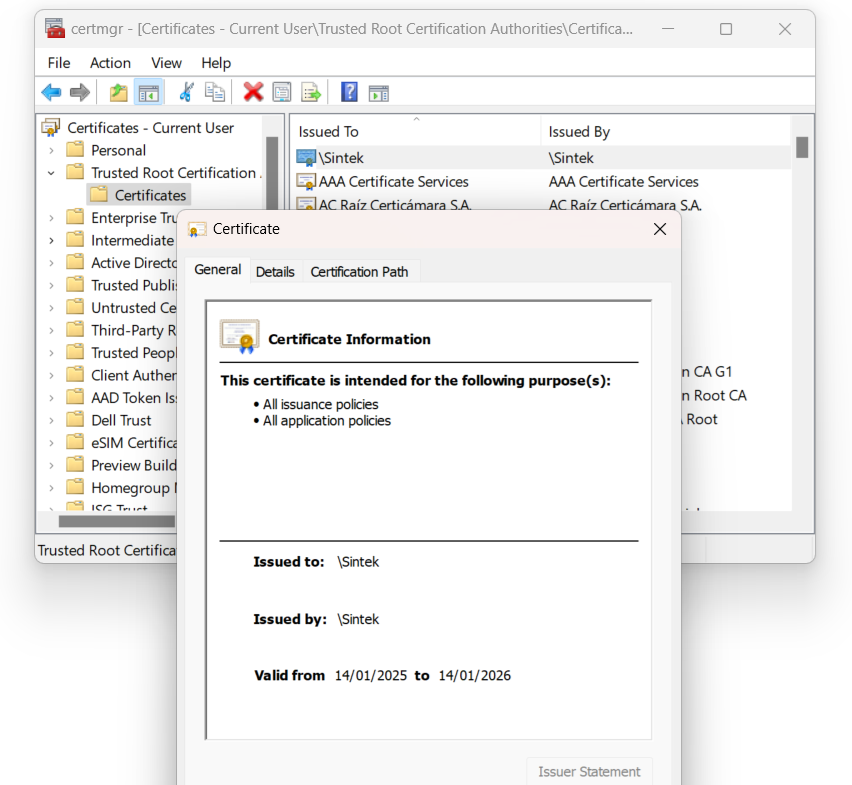
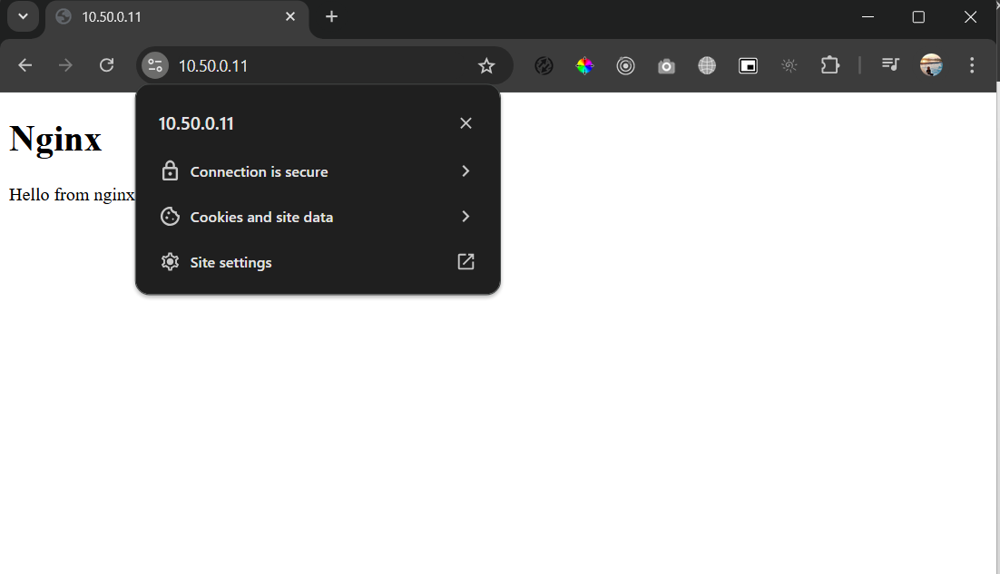

# Create a Valid Self Signed SSL Certificate

## Generate Private CA
```bash
# make dir selfsigned-certs
$ sudo mkdir selfsigned-certs

# generates a 4096-bit RSA private key that is encrypted using AES-256
$ sudo openssl genrsa --aes256 -out ca-key.pem 4096

Generating RSA private key, 4096 bit long modulus (2 primes)
........................................++++
.++++
e is 65537 (0x010001)
Enter pass phrase for ca-key.pem:
Verifying - Enter pass phrase for ca-key.pem:

# generate ca.pem from ca-key.pem
$ sudo openssl req -new -x509 -sha256 -days 365 -key ca-key.pem -out ca.pem

# get ca.pem info
$ sudo openssl x509 -in ca.pem -text

# generates a 2048-bit RSA private key that is not encrypted
$  sudo openssl genrsa -out cert-key.pem 4096
$ sudo openssl req -new -sha256 -subj "/CN=Sintek" -key cert-key.pem -out cert.csr
$ sudo sh -c 'echo "subjectAltName=DNS:*.anangsu13.com,IP:10.50.0.11,IP:10.50.0.12" >> /path/to/extfile.cnf'
$ sudo openssl x509 -req -sha256 -days 365 -in cert.csr -CA ca.pem -CAkey ca-key.pem -out cert.pem -extfile extfile.cnf -CAcreateserial
$ ls
ca-key.pem  ca.pem  ca.srl  cert-key.pem  cert.csr  cert.pem  extfile.cnf

$ sudo sh -c 'cat cert.pem > /path/to/fullchain.pem'
$ sudo sh -c 'cat cert.pem >> /path/to/fullchain.pem'
```

## Nginx in Docker Container with SSL

Project Directory Structure
```
/nginx-ssl
    /certs
        cert-key.pem          # Private Key
        fullchain.pem
    nginx.conf        # Konfigurasi Nginx
    Dockerfile
    html/
        index.html
```
nginx.conf
```bash
server {
    listen 80;
    server_name nginx.anangsu13.com;

    # Redirect HTTP ke HTTPS
    return 301 https://$host$request_uri;
}

server {
    listen 443 ssl;
    server_name nginx.anangsu13.com;

    ssl_certificate /etc/nginx/certs/fullchain.pem;  # Full chain certificate
    ssl_certificate_key /etc/nginx/certs/cert-key.pem;  # Private key
    ssl_trusted_certificate /etc/nginx/certs/fullchain.pem;  # Sertifikat intermediate, jika diperlukan
    ssl_protocols TLSv1.2 TLSv1.3;  # Pastikan TLSv1.2 dan TLSv1.3 diaktifkan
    ssl_ciphers 'ECDHE-ECDSA-AES128-GCM-SHA256:ECDHE-RSA-AES128-GCM-SHA256:!AES128-GCM-SHA256:!RC4-SHA:!MD5:!aNULL:!eNULL';  # Daftar cipher yang kompatibel

    root /usr/share/nginx/html;
    index index.html;

    location / {
        try_files $uri $uri/ =404;
    }
}
```

Dockerfile
```dockerfile
# Menggunakan image Nginx resmi sebagai base image
FROM nginx:latest

# Menyalin file konfigurasi Nginx ke dalam container
COPY ./nginx.conf /etc/nginx/conf.d/nginx.conf

# Menyalin sertifikat SSL (server.crt, server.key, intermediate.crt) ke dalam container
COPY ./certs /etc/nginx/certs

# Menyalin folder HTML (jika diperlukan untuk tes)
COPY ./html /usr/share/nginx/html
```

Build docker image
```bash
$ sudo docker build -t nginx-ssl .
```

Run nginx as a docker container with static IP 10.50.0.11
```bash
$ sudo docker run -d -p 80:80 -p 443:443 \
    --name nginx-ssl \
    --net ipvlan-network \
    --ip 10.50.0.11 \
    nginx-ssl
```

Import Private CA in Windows
 ```powershell
# Run PowerShell as Adminstrator
$ Import-Certificate -FilePath "certs/ca.pem" -CertStoreLocation Cert:\LocalMachine\Root


   PSParentPath: Microsoft.PowerShell.Security\Certificate::LocalMachine\Root

Thumbprint                                Subject
----------                                -------
70D87771F915C6A658605096F7F7A6C99D6C3166  E=anang.su13@gmail.com, CN=\Sintek, OU=IT, O=Sintek Corp., L=Bandung, S=We...
```


Access nginx service with SSL
https://10.50.0.11/

